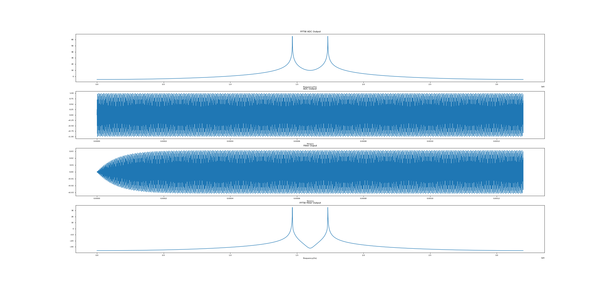
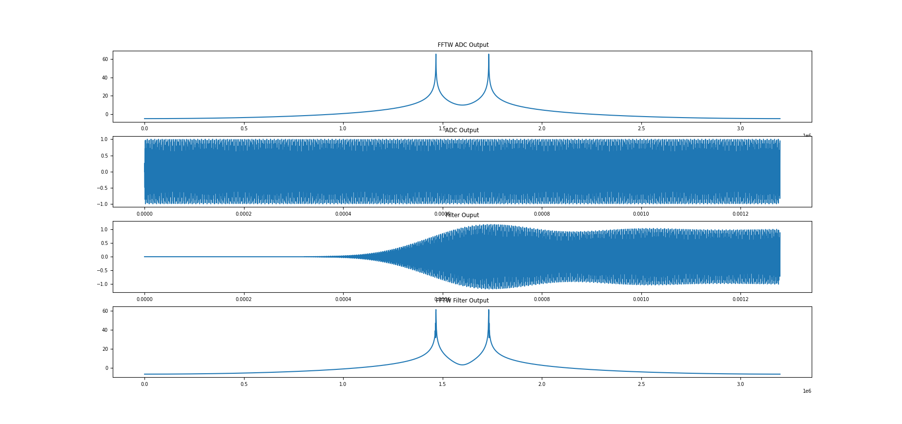
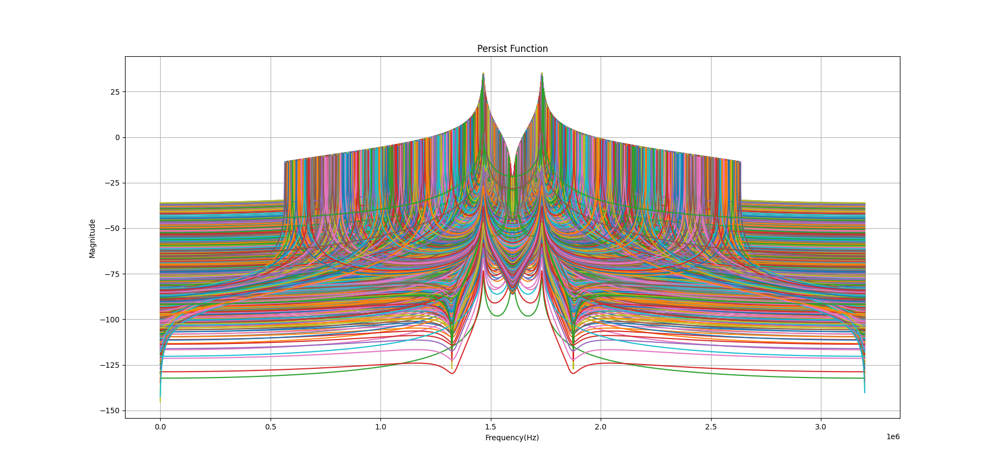
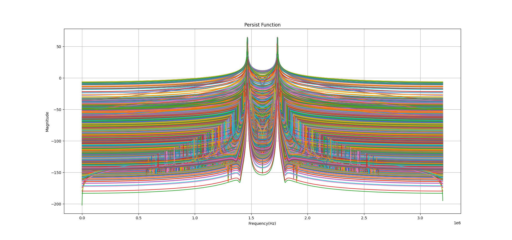
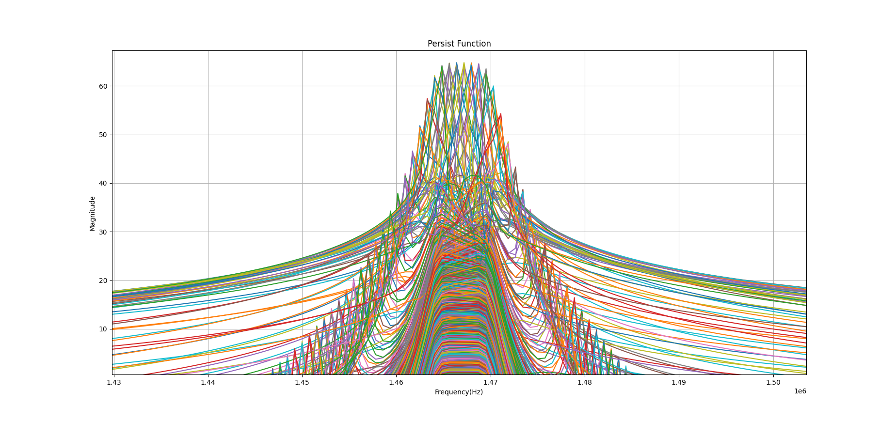
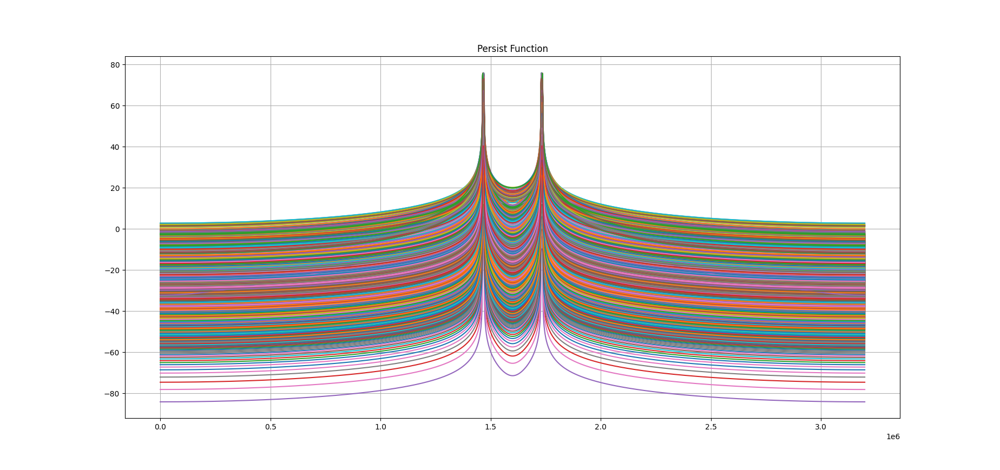
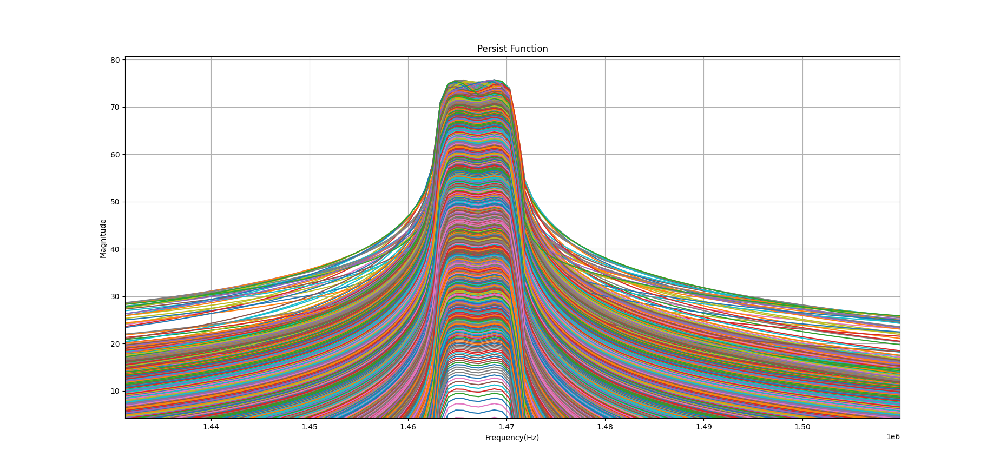
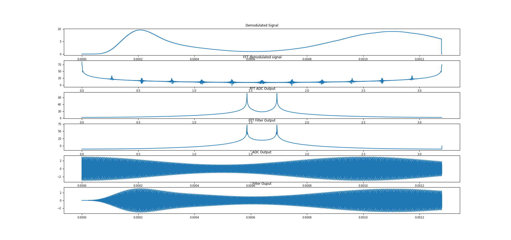

# FIR and IIR Filter Synthesizer in C

The c file can calculate the filter coefficients for both FIR and IIR filters. The FIR filters that can be synthesised are Hanning, Hamming and Blackman Window Functions. The IIR filter is calculated using Pascals Triangle. The FFTs can be performed by libraries such as fftw3 and UFFT.

## Installation
- Installlation instructions are for FFTW3 are availble on [[2]](#2).

## Usage

The implementation of both FIR was done directly in the C program "FIRandIIR.c". The setup was:
- A virtual machine(Oracle Virtual Box) was set up. The machine was running Ubuntu 20.04 LTS.
- Text Editor: Visual Studio Code 1.56.2, with C/C++ - "C/C++ IntelliSense, debugging, and code browsing" Extension and Python - "IntelliSense (Pylance), Linting, Debugging (multi-threaded, remote), Jupyter Notebooks, code formatting, refactoring, unit tests, and more" extension Installed.
- The C compiler: GCC version 9.3
- Python: v3.9

## Python

Two Python scripts were used to view the output of the C program. The C program has a function called *toTexfile* that writes the output in a format that Python can display. 

The Python script that plots the coefficients of the IIR filter is called "filterCoeffs.py". The Python script that plots the time series and FFT data from the C program is called "main.py". The script that mimics the persist function on an oscilloscope is called "persist.py". 

In the "paramters.py" script, the variable "fs" is the sampling frequency that is used to plot the resulting output correctly. "fs" must equal the sampling frequency in the C script.

### C Execution

The C program has the following setup, initially commenting out and uncommenting will set the program up for specific executions.

The variable "q" is the power $2^q$, which specifies the number of points of the FFT.

Choose if the program should run the FFT functions. It is recommended to leave this setting alone. 

**FFT**
Uncomment the following setting if plotting data output is important. 
miscellaneous 

- MODSIG  - Define if AM mod signal is required
- DEMODSIG - Define if Demodulation of the output signal is required

Choose the method of coefficient calculation
- **FIR** 
- **IIR_PASCALS**

The next setting is **PLOTFILTERCOEFFS**. This setting removes the gain from the IIR filter coefficients and writes it to a text file that Python can read in. The Python function then reads in the filter coefficient and passes them the "freqz" function from the "signal" library, and they get plotted. "filterCoeffs.py" should be run during this process while none of the other python scripts is running.

Under the FIR selection block, the following settings are available:

**FIR**
- HANNING 
- HAMMING 
- BLACKMAN
  
After which two methods of implementation is available:
- **TRANSVERSAL**
- **FASTCONV**

Where TRANSVERSAL is the transversal realisation structure, and FASTCONV is Fast Convolution implementation.

The IIR Pascals method [[1]](#1) is used for filter coefficient synthesis. The following selections for the different filter setups are available to the user.

**IIR_PASCALS**
- BANDPASS
- LP_HP 
- BANDPASS_CASCADED

BANDPASS uses a direct synthesis method in which all of the calculated coefficients are not split into second-order cascaded stages. LP_HP uses a cascade of lowpass and high pass IIR filters to generate a high pass filter (the attenuation is much larger than the direct synthesis method). 

After which two methods of implementation is available:
- BUTTERWORTH
- ELLIPTICAL

The BANDPASS setting does not cascade the stages like the implementation would normally do, but this does provide a good approximation of what the filter will look like. If BANDPASS is selected, the following options are available:

- FIRST_ORDER_DIRECT_BANDPASS
- SECOND_ORDER_DIRECT_BANDPASS - Which is the only setting that can be used on elliptical
- THIRD_ORDER_DIRECT_BANDPASS
- FOURTH_ORDER_DIRECT_BANDPASS
- TENTH_ORDER_DIRECT_BANDPASS - Tenth order is unstable

If LP_HP is selected, the following options are available:

- SECOND_ORDER_2ND_ORDER_LP_HP_CASCADED 
- FOURTH_ORDER_2ND_ORDER_LP_HP_CASCADED
- FOURTH_ORDER_SAME_2ND_ORDER_LP_HP_CASCADED - special case
- SIXTH_ORDER_LP_HP_CASCADED_SPECIAL - Change n=6 for this one
- EIGHTH_ORDER_2ND_ORDER_LP_HP_CASCADED

If BANDPASS_CASCADED is selected, the following options are availble:
- FOURTH_ORDER_2NDORDER_BANDPASS_CASCADED
- EIGHTH_ORDER_2NDORDER_BANDPASS_CASCADED
- TENTH_ORDER_2NDORDER_BANDPASS_CASCADED
- TWENTIETH_ORDER_4THORDER_BANDPASS_CASCADED 
- FOURTHIETH_ORDER_10THORDER_BANDPASS_CASCADED - Tenth Order is extremely unstable (so would not recommend)

Then the user should adjust the value of n, which determines the order of the filter. Remember that for a direct bandpass realisation, the order should double what the lowpass prototype order is, and when LP_HP is used, the order must match the prototype filter.

The next bit of setup is for the user if they would like to use a specific implementation of the FFT. Two FFT implementations are available, namely FFTW3[[2]](#2) and UFFT[[3]](#3):
- UFFT
- FFTW

The persist function is also available for use and should be used in conjunction with the "persist.py" script. The persist function works similar to that of an oscilloscope's persist function as it sweeps the values and plots the filter response:
- PERSIST
 
FFTW3 was set up to use multi-threading, avx optimisations and long-doubles. This was to achieve the most accurate results possible and avoid. UFFT can also be used should the user choose not to use fftw3. Its performance is close to that of FFTW in most cases on an x64 based system. It is a viable option to show the user who does not have fftw3 on their system. PERSIST should be uncommented when the user wants to view the frequency response of a cascaded system as the Python scripts cannot implement the cascade values as needed. The number of lines plotted for the Persist Function equal the FFT Size ($2^q$).

Finally the C program is run using the following command is the terminal: 
    gcc FIRandIIR.c -I/usr/local/include -L/usr/local/lib -lfftw3 -lm -o Prac3 

To build the project. Running the project is done with the following command: 
    ./filterSynthesis 

Using the extension in visual studio code, run the Python code using the "ctrl+F5" to start the Python script (or run "python3 {Script Name}.py"). The "main.py" file will plot all of the textfiles with data on one graph, and this can be changed in the code setup itself that it plots separate graphs.

The following are some of the results generated from the program. All modes are not displayed below.

**Figure 1: FFTW Library and resulting filter outputs in time and frequency domain**

**Figure 2: FFTW Library and resulting filter outputs in time and frequency domain**

**Figure 3: Persist function for 2nd Order Butterworth Bandpass Filter**

**Figure 4: Persist function for 8th Order Bandpass Filter**

**Figure 5: Zoomed in view of persist function for 8th Order Bandpass Filter**

**Figure 6: 105th Channel Hanning FIR Persist Function**

**Figure 7: 105th Channel Hamming FIR Persist Function zoomed in**

**Figure 8: Demodulated Signal Output**

## Todo 
- [ ] Split into multiple files 
- [ ] Check instable results
- [ ] Do pole matching to cancel the effect of zeros (what CMSIS does with their arm_biquad_cascade functions) to help with stability. Direct synthesis method cause instability with higher order systems
- [ ] Make "fillterCoeffs.py" adjustable to a different number of stages
- [ ] Make a single plotting script in Python becuase the plotting code in "main.py", "filterCoeffs.py" and "persist.py" is the same.

## References
<a id="1">[1]</a>
Nguyen, Phuoc. (2013). Bilinear z-transformation and Pascal's triangle.. International Journal of Scientific and Engineering Research. 4. 1974-1978. 

<a id="2">[2]</a>
FFTW Home Page. https://www.fftw.org/

<a id="3">[3]</a>
FFTW Home Page. https://www.fftw.org/.
"UFFT." Faculty of Information Technology, Brno University of Technology, https://www.fit.vut.cz/research/product/510/. 

